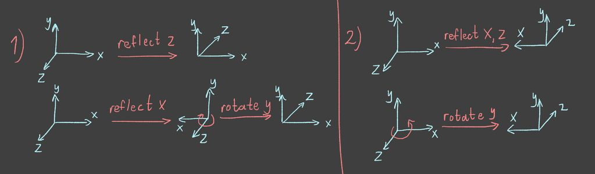

# glTF TRS matrix decomposition

## Just give me the code

I'm not going to write any code, only explain it, go steal it from [gltfpack](https://github.com/zeux/meshoptimizer/tree/master/gltf):

```cpp
void decomposeTransform(float translation[3], float rotation[4], float scale[3], const float* transform)
{
	float m[4][4] = {};
	memcpy(m, transform, 16 * sizeof(float));

	// extract translation from last row
	translation[0] = m[3][0];
	translation[1] = m[3][1];
	translation[2] = m[3][2];

	// compute determinant to determine handedness
	float det =
	    m[0][0] * (m[1][1] * m[2][2] - m[2][1] * m[1][2]) -
	    m[0][1] * (m[1][0] * m[2][2] - m[1][2] * m[2][0]) +
	    m[0][2] * (m[1][0] * m[2][1] - m[1][1] * m[2][0]);

	float sign = (det < 0.f) ? -1.f : 1.f;

	// recover scale from axis lengths
	scale[0] = sqrtf(m[0][0] * m[0][0] + m[0][1] * m[0][1] + m[0][2] * m[0][2]) * sign;
	scale[1] = sqrtf(m[1][0] * m[1][0] + m[1][1] * m[1][1] + m[1][2] * m[1][2]) * sign;
	scale[2] = sqrtf(m[2][0] * m[2][0] + m[2][1] * m[2][1] + m[2][2] * m[2][2]) * sign;

	// normalize axes to get a pure rotation matrix
	float rsx = (scale[0] == 0.f) ? 0.f : 1.f / scale[0];
	float rsy = (scale[1] == 0.f) ? 0.f : 1.f / scale[1];
	float rsz = (scale[2] == 0.f) ? 0.f : 1.f / scale[2];

	float r00 = m[0][0] * rsx, r10 = m[1][0] * rsy, r20 = m[2][0] * rsz;
	float r01 = m[0][1] * rsx, r11 = m[1][1] * rsy, r21 = m[2][1] * rsz;
	float r02 = m[0][2] * rsx, r12 = m[1][2] * rsy, r22 = m[2][2] * rsz;

	// "branchless" version of Mike Day's matrix to quaternion conversion
	int qc = r22 < 0 ? (r00 > r11 ? 0 : 1) : (r00 < -r11 ? 2 : 3);
	float qs1 = qc & 2 ? -1.f : 1.f;
	float qs2 = qc & 1 ? -1.f : 1.f;
	float qs3 = (qc - 1) & 2 ? -1.f : 1.f;

	float qt = 1.f - qs3 * r00 - qs2 * r11 - qs1 * r22;
	float qs = 0.5f / sqrtf(qt);

	rotation[qc ^ 0] = qs * qt;
	rotation[qc ^ 1] = qs * (r01 + qs1 * r10);
	rotation[qc ^ 2] = qs * (r20 + qs2 * r02);
	rotation[qc ^ 3] = qs * (r12 + qs3 * r21);
}
```

Transform matrix is assumed to be in a column-major order.

If you use `wxyz` instead of `xyzw` for quaternions, then change the xor indices in the last 4 lines:

```cpp
    rotation[qc ^ 3] = /* ... */
    rotation[qc ^ 0] = /* ... */
    rotation[qc ^ 1] = /* ... */
    rotation[qc ^ 2] = /* ... */
```

Note that if you have negative scales, decomposition is ambiguous for rotation and scale, if that's a problem for you, consider using TRS properties directly if possible. To understand why there's an ambiguity, read on.

## Decomposition ambiguity

Firstly, I should mention that for glTF transform matrix:

- [shear is not allowed](https://registry.khronos.org/glTF/specs/2.0/glTF-2.0.html#transformations)
- [negative scales are allowed](https://registry.khronos.org/glTF/specs/2.0/glTF-2.0.html#instantiation)

The first one simplifies the decomposition, the second one introduces an ambiguity.

With the presence of negative scales (basically a reflection), decomposition is ambiguous for rotation and scale, since:
1. a reflection in 1 axis can be represented as a reflection in any other axis plus a rotation
2. a reflection in 2 axes can be represented as a rotation

If you have trouble visualizing it, you can think about it in terms of basis transformation:



Notice how a reflection in 1 axis changes the basis handedness, but a reflection in 2 axes does not. Reflection in all 3 axes (not shown on the picture) also changes the handedness.

Basically, if you use negative scales, then there's no unique decomposition. Information is lost when combining TRS components into the transformation matrix, since this matrix represents the **final** transformation and can be represented with multiple combinations of RS components. Translation component is always unambiguous.

## How is a TRS matrix composed

Translation matrix:

```math
T = \begin{pmatrix}
  1 & 0 & 0 & t_x \\
  0 & 1 & 0 & t_y \\
  0 & 0 & 1 & t_z \\
  0 & 0 & 0 & 1
\end{pmatrix}
```

Rotation matrix:

```math
R = \begin{pmatrix}
  r_{00} & r_{01} & r_{02} & 0 \\
  r_{10} & r_{11} & r_{12} & 0 \\
  r_{20} & r_{21} & r_{22} & 0 \\
  0 & 0 & 0 & 1
\end{pmatrix}
```

Scale matrix:

```math
S = \begin{pmatrix}
  s_x & 0 & 0 & 0 \\
  0 & s_y & 0 & 0 \\
  0 & 0 & s_z & 0 \\
  0 & 0 & 0 & 1
\end{pmatrix}
```

TRS matrix:

```math
TRS =
\begin{pmatrix}
  1 & 0 & 0 & t_x \\
  0 & 1 & 0 & t_y \\
  0 & 0 & 1 & t_z \\
  0 & 0 & 0 & 1
\end{pmatrix}
\begin{pmatrix}
  r_{00} & r_{01} & r_{02} & 0 \\
  r_{10} & r_{11} & r_{12} & 0 \\
  r_{20} & r_{21} & r_{22} & 0 \\
  0 & 0 & 0 & 1
\end{pmatrix}
\begin{pmatrix}
  s_x & 0 & 0 & 0 \\
  0 & s_y & 0 & 0 \\
  0 & 0 & s_z & 0 \\
  0 & 0 & 0 & 1
\end{pmatrix}
=
```

```math
\begin{pmatrix}
  1 & 0 & 0 & t_x \\
  0 & 1 & 0 & t_y \\
  0 & 0 & 1 & t_z \\
  0 & 0 & 0 & 1
\end{pmatrix}
\begin{pmatrix}
r_{00}s_x & r_{01}s_y & r_{02}s_z & 0 \\
r_{10}s_x & r_{11}s_y & r_{12}s_z & 0 \\
r_{20}s_x & r_{21}s_y & r_{22}s_z & 0 \\
0 & 0 & 0 & 1
\end{pmatrix}
=
```

```math
\begin{pmatrix}
r_{00}s_x & r_{01}s_y & r_{02}s_z & t_x \\
r_{10}s_x & r_{11}s_y & r_{12}s_z & t_y \\
r_{20}s_x & r_{21}s_y & r_{22}s_z & t_z \\
0 & 0 & 0 & 1
\end{pmatrix}
```

## Translation

From the TRS matrix equation it's obvious that we can just grab translation from the last column:

```cpp
// extract translation from last row
translation[0] = m[3][0];
translation[1] = m[3][1];
translation[2] = m[3][2];
```

Since `m` is in the column-major order, this will access `transform[12]`, `transform[13]`, `transform[14]` (the last column).

Notice how translation is always unambiguous, unlike rotation and scale.

## Scale

This is a little bit trickier, since scales can be negative.

As we've shown, odd amount of reflections (1 or 3) changes the basis handedness, we can check the sign of the transformation matrix determinant, if it's negative then the matrix changes the handedness.

To compute a determinant of a square matrix $A$, we can use the [Laplace expansion](https://en.wikipedia.org/wiki/Determinant#Laplace_expansion) along the $i$-th row:

```math
\det(A) = \sum _{j=0}^{n-1} (-1)^{i+j} a_{i,j} M_{i, j}
```

Where $`M_{i, j}`$ is a minor (the determinant of the $`(n-1)\times(n-1)`$ matrix that results from $A$ by removing the $i$-th row and $j$-th column.

We can use the last row of a TRS matrix, since there are 3 zeros:

```math
\det(TRS) = 0 + 0 + 0 + (-1)^{3+3} \cdot 1 \cdot M_{3, 3} =
\begin{vmatrix}
r_{00}s_x & r_{01}s_y & r_{02}s_z \\
r_{10}s_x & r_{11}s_y & r_{12}s_z \\
r_{20}s_x & r_{21}s_y & r_{22}s_z
\end{vmatrix}
```

Notice how it makes sense both mathematically and intuitively, translation can't change the handedness.

The final determinant can be computed by using the Laplace expansion along the 0-th column:

```cpp
// compute determinant to determine handedness
float det =
    m[0][0] * (m[1][1] * m[2][2] - m[2][1] * m[1][2]) -
    m[0][1] * (m[1][0] * m[2][2] - m[1][2] * m[2][0]) +
    m[0][2] * (m[1][0] * m[2][1] - m[1][1] * m[2][0]);

float sign = (det < 0.f) ? -1.f : 1.f;
```

Pure rotation matrices are orthogonal (their columns and rows are orthonormal vectors), therefore we can extract scales from axis lengths (taking into account the sign):

```cpp
// recover scale from axis lengths
scale[0] = sqrtf(m[0][0] * m[0][0] + m[0][1] * m[0][1] + m[0][2] * m[0][2]) * sign;
scale[1] = sqrtf(m[1][0] * m[1][0] + m[1][1] * m[1][1] + m[1][2] * m[1][2]) * sign;
scale[2] = sqrtf(m[2][0] * m[2][0] + m[2][1] * m[2][1] + m[2][2] * m[2][2]) * sign;
```

So, if we detect that the TRS matrix changes handedness (negative determinant), there is an odd amount of reflections (1 or 3, this function assumes 3), so we flip the signs (all scales are negative).

## Rotation matrix

To extract a pure rotation matrix, we just need to normalize axes by dividing them by scales:

```cpp
// normalize axes to get a pure rotation matrix
float rsx = (scale[0] == 0.f) ? 0.f : 1.f / scale[0];
float rsy = (scale[1] == 0.f) ? 0.f : 1.f / scale[1];
float rsz = (scale[2] == 0.f) ? 0.f : 1.f / scale[2];

float r00 = m[0][0] * rsx, r10 = m[1][0] * rsy, r20 = m[2][0] * rsz;
float r01 = m[0][1] * rsx, r11 = m[1][1] * rsy, r21 = m[2][1] * rsz;
float r02 = m[0][2] * rsx, r12 = m[1][2] * rsy, r22 = m[2][2] * rsz;
```

## Rotation quaternion

I'm not going to explain the process of extracting a unit quaternion from a rotation matrix, since it's explained in the article [Converting a Rotation Matrix to a Quaternion by Mike Day](https://web.archive.org/web/20250725144610/https://d3cw3dd2w32x2b.cloudfront.net/wp-content/uploads/2015/01/matrix-to-quat.pdf). There are all the derivations and explanations why this method is numerically stable.

However, gltfpack's `decomposeTransform` function contains the "branchless" version of the code presented in the article and it uses a fun trick.

As an aside, the gltfpack author put "branchless" in quotes, that's probably because the code contains branches (ternary operators). Ternary operators and if statements do not always result in a branch, CPUs have some specialized instructions (i.e. conditional move and set) that can be used by a compiler to avoid branching. Also, predictable branches are basically free on modern CPUs with multi-level branch predictors, but I suppose that the gltfpack author has probably used the "branchless" version because it has better codegen, I'm not sure though.

Here's the original code from the Mike Day's article:

```cpp
if (m22 < 0)
{
    if (m00 > m11)
    {
        t = 1 + m00 - m11 - m22;
        q = quat( t, m01+m10, m20+m02, m12-m21 );
    }
    else
    {
        t = 1 - m00 + m11 - m22;
        q = quat( m01+m10, t, m12+m21, m20-m02 );
    }
}
else
{
    if (m00 < -m11)
    {
        t = 1 - m00 - m11 + m22;
        q = quat( m20+m02, m12+m21, t, m01-m10 );
    }
    else
    {
        t = 1 + m00 + m11 + m22;
        q = quat( m12-m21, m20-m02, m01-m10, t );
    }
}

q *= 0.5 / Sqrt(t);
```

And the "branchless" version from gltfpack:

```cpp
// "branchless" version of Mike Day's matrix to quaternion conversion
int qc = r22 < 0 ? (r00 > r11 ? 0 : 1) : (r00 < -r11 ? 2 : 3);
float qs1 = qc & 2 ? -1.f : 1.f;
float qs2 = qc & 1 ? -1.f : 1.f;
float qs3 = (qc - 1) & 2 ? -1.f : 1.f;

float qt = 1.f - qs3 * r00 - qs2 * r11 - qs1 * r22;
float qs = 0.5f / sqrtf(qt);

rotation[qc ^ 0] = qs * qt;
rotation[qc ^ 1] = qs * (r01 + qs1 * r10);
rotation[qc ^ 2] = qs * (r20 + qs2 * r02);
rotation[qc ^ 3] = qs * (r12 + qs3 * r21);
```

Let's start with the simpler stuff, `qc` represents a conditional, it's an int from 0 to 3 that corresponds to the respective branches from the original code.

If you look at the original code, the expression for `t` is mostly the same, only signs differ, in the "branchless" version these signs are in variables `qs1`, `qs2`, `qs3`. For example, let's verify that the code is the same for the first branch:

```
qc = 0
qs1 = 0 & 2 ? -1.0 : 1.0 = 1.0
qs2 = 0 & 1 ? -1.0 : 1.0 = 1.0
qs3 = -1 & 2 ? -1.0 : 1.0 = 0xffffffff & 2 ? -1.0 : 1.0 = -1.0 (assuming two's complement)
qt = 1.0 + r00 - r11 - r22
```

This is indeed the same expression as `t` in the first branch of the original code.

Now for the fun stuff, we can use `qc` not only for determining the signs, but also to "shuffle" storing indices. Let's take a look at the original code, notice how in branches quaternion's components are calculated similarly, just in a different order and with different signs:

```cpp
q = quat(t,       m01+m10, m20+m02, m12-m21); // 0 1 2 3
q = quat(m01+m10, t,       m12+m21, m20-m02); // 1 0 3 2
q = quat(m20+m02, m12+m21, t,       m01-m10); // 2 3 0 1
q = quat(m12-m21, m20-m02, m01-m10, t);       // 3 2 1 0
```

We already know how to deal with different signs (`qs1`, `qs2`, `qs3`), but how do we reorder indices?

We can use xor to to do it, let's start with the first case. Xoring with 0 doesn't change anything, if you check the code comments above, it represents the first case (0, 1, 2, 3).

If we xor with 1, we'll get the second case:

| op1 | op2 | result hex | result dec |
| - | - | - | - |
| 0b00 | 0b01 | 0b01 | 1 |
| 0b01 | 0b01 | 0b00 | 0 |
| 0b10 | 0b01 | 0b11 | 3 |
| 0b11 | 0b01 | 0b10 | 2 |

If we xor with 2, we'll get the third case:

| op1 | op2 | result hex | result dec |
| - | - | - | - |
| 0b00 | 0b10 | 0b10 | 2 |
| 0b01 | 0b10 | 0b11 | 3 |
| 0b10 | 0b10 | 0b00 | 0 |
| 0b11 | 0b10 | 0b01 | 1 |

The last one can be verified the same way. And with that we've verified that the "branchless" code behaves the same.

That's it, now you can steal the code from gltfpack and not feel guilty.
