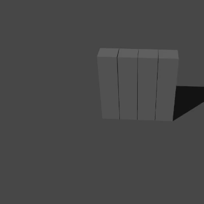
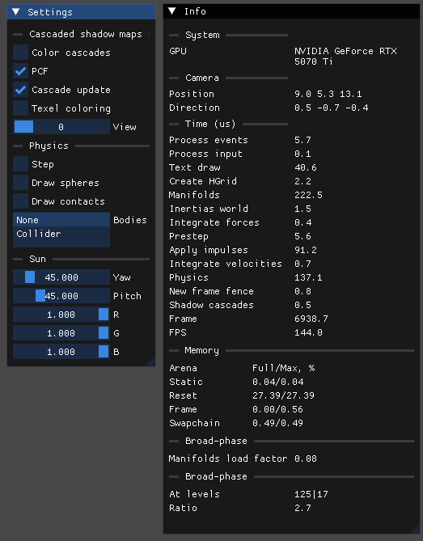

# demos

3D rigid body (spheres, convex hulls) physics simulator with friction with a vulkan renderer.

Graphics features:
- debug renderer (Vulkan 1.3)
- DrawIndexedIndirect rendering for 3d shapes
- stable cascaded shadow maps (CSM)
- soft shadows (PCF with adaptive sampling)

Physics features:

- rigid body dynamics simulation between arbitrary convex polyhedra
- sequential impulses solver (PGS), essentially, this is a port of box2d-lite to 3D
- stable stacking (one-shot manifolds with contact reduction and feature identification, warm starting)
- friction
- broad-phase (hierarchical grid)

**WARNING** for Windows users: totally untested on windows and MSVC, expect issues.

**WARNING:** the code is not production ready, it may be buggy, non-robust and unoptimized, it's definetely [non-deterministic](https://box2d.org/posts/2024/08/determinism/).

## Preview

### Rigid body dynamics simulation between arbitrary convex polyhedra



### Fun stuff when solver fails to converge quickly enough and significant interpenetration occurs


### Debug UI (settings and statistics)



## Build and run

Dependencies (bundled):
- volk
- SDL3
- Dear ImGui

You also need [Vulkan SDK](https://vulkan.lunarg.com/sdk/home) (not bundled).

Building SDL3 may require [additional dependencies](https://github.com/libsdl-org/SDL/blob/main/docs/README-linux.md#build-dependencies) depending on your OS.

```
cmake -B build -DCMAKE_BUILD_TYPE=Release -G Ninja
cmake --build build
cd build
./demo
```

## Controls

- WASD/ZX -- position control, Z/X are down/up, you can choose a body from the menu to control it instead
- Shift -- accelerate
- Escape -- close
- . -- toggle fullscreen
- u -- toggle UI
- m -- toggle mouse
- r -- restart simulation (Shift+R to restart and reduce time step for more accurate simulation in slow motion)
- p -- step 1 tick if physics stepping is enabled

## Resources

### Physics

#### General

- [Physically Based Modeling, David Baraff](https://graphics.stanford.edu/courses/cs448b-00-winter/papers/phys_model.pdf)
- [Constraints Derivation for Rigid Body Simulation in 3D, Daniel Chappuis](https://danielchappuis.ch/download/ConstraintsDerivationRigidBody3D.pdf)
- [Polyhedral Mass Properties (Revisited), David Eberly](https://www.geometrictools.com/Documentation/PolyhedralMassProperties.pdf)

#### Sequential Impulses

- [Fast and Simple Physics using Sequential Impulses, Erin Catto](https://box2d.org/files/ErinCatto_SequentialImpulses_GDC2006.pdf)
- [box2d-lite, Erin Catto](https://github.com/erincatto/box2d-lite)
- [box2d, Erin Catto](https://github.com/erincatto/box2d)
- [qu3e, Randy Gaul](https://github.com/RandyGaul/qu3e)

#### Contact manifold creation

- [Collision Detection in 2D or 3D – Some Steps for Success, Randy Gaul](https://randygaul.github.io/collision-detection/2019/06/19/Collision-Detection-in-2D-Some-Steps-for-Success.html)
- Real-Time Collision Detection, Christer Ericson
- [Robust Contact Creation for Physics Simulation, Dirk Gregorius](https://gdcvault.com/play/1022194/Physics-for-Game-Programmers-Robust)
- [The Separating Axis Test between Convex Polyhedra, Dirk Gregorius](https://media.gdcvault.com/gdc2013/slides/822403Gregorius_Dirk_TheSeparatingAxisTest.pdf)
- [GJK implementation in 3D, vurtun](https://gist.github.com/vurtun/29727217c269a2fbf4c0ed9a1d11cb40)

### Graphics

- [Learn OpenGL](https://learnopengl.com)
- [Khronos Vulkan Tutorial](https://docs.vulkan.org/tutorial/latest/00_Introduction.html)
- [The curious case of Vulkan Swapchain synchronization, Rob2309](https://www.reddit.com/r/vulkan/comments/1dg0wqq/the_curious_case_of_vulkan_swapchain/)
- [Yet another blog explaining Vulkan synchronization, Maister](https://themaister.net/blog/2019/08/14/yet-another-blog-explaining-vulkan-synchronization/)
- [Vulkan examples, Sascha Willems](https://github.com/SaschaWillems/Vulkan) (VulkanUIOverlay, shadowmappingcascade)
- [Reversed-Z in OpenGL, nlguillemot](https://nlguillemot.wordpress.com/2016/12/07/reversed-z-in-opengl/)
- [OpenGL Cascaded Shadow Maps, johanmedestrom](https://johanmedestrom.wordpress.com/2016/03/18/opengl-cascaded-shadow-maps/)
- [Cascaded Shadow Maps with Soft Shadows, Alex Tardif](https://alextardif.com/shadowmapping.html)
- [Improving shadow map utilization for cascaded shadow maps, Sebastian Sylvan](https://www.sebastiansylvan.com/post/improving-shadow-map-utilization-for-cascaded-shadow-maps/)
- [GPU gems 2, Chapter 17, Efficient Soft-Edged Shadows Using Pixel Shader Branching, Yury Uralsky](https://developer.nvidia.com/gpugems/gpugems2/part-ii-shading-lighting-and-shadows/chapter-17-efficient-soft-edged-shadows-using)
