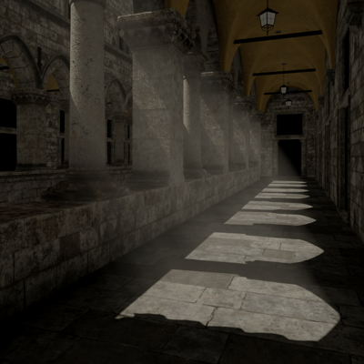

# \[WIP\] Renderer

 GPU-driven renderer (Vulkan 1.4).

## TODO

So far there are some bugs in Slang (such as [this](https://github.com/shader-slang/slang/issues/7019) or [that](https://github.com/shader-slang/slang/issues/10123)).

- if mesh shader support doesn't improve in Slang, switch to HLSL (dxc)
- use mesh shaders to generate triangle ids for a visibility buffer
- meshlet frustum, backface, occlusion (Hi-Z) culling

## Preview



## Features

- visibility buffer -> "forward" rendering
- PBR (metallic workflow, no IBL)
- normal mapping
- HDR (HDR -> SDR)
- TAA
- hardware raytraced hard directional shadow
- GPU frustum culling
- bindless textures (descriptor indexing)
- indirect drawing
- SPIR-V reflection to manage push descriptors

## Build and run

Dependencies (included as git submodules):

- SDL
- volk
- VulkanMemoryAllocator
- SPIRV-Cross
- imgui
- cgltf
- KTX-Software
- meshoptimizer

You also need [Vulkan SDK](https://vulkan.lunarg.com/sdk/home) (not bundled).

Building SDL may require [additional dependencies](https://github.com/libsdl-org/SDL/blob/main/docs/README-linux.md#build-dependencies) depending on your OS.

```
git submodule init
git submodule update
cmake -B Build -DCMAKE_BUILD_TYPE=Release -G Ninja
cmake --build Build
```

To run, you need the [Intel Sponza](https://www.intel.com/content/www/us/en/developer/topic-technology/graphics-research/samples.html) asset, download it and put it in the `Assets` directory.

You also need to convert png textures to ktx2, using `ktx` utility from [KTX-Software](https://github.com/KhronosGroup/KTX-Software):

```
git clone https://github.com/KhronosGroup/KTX-Software.git
cd KTX-Software
cmake . -G Ninja -B build -DCMAKE_BUILD_TYPE=Release -DKTX_FEATURE_TOOLS=ON
cmake --build build
```

After building and installing (install somewhere in the `PATH`, put `libktx.so` there too):

```
cd Assets
./toktx_intel_sponza.sh
```

This will take a while.

## Controls

- WASD/ZX -- position control, Z/X are down/up
- Escape -- close
- . -- toggle fullscreen
- u -- toggle UI
- m -- toggle mouse
- c -- freeze camera to visualize culling
